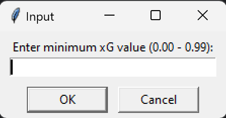
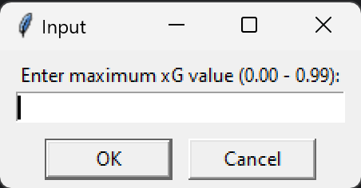
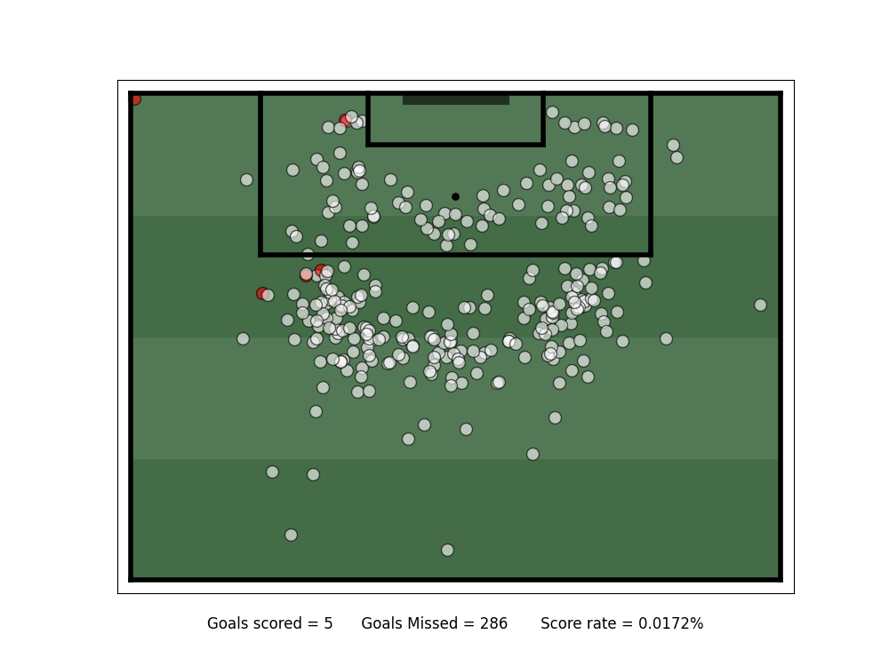
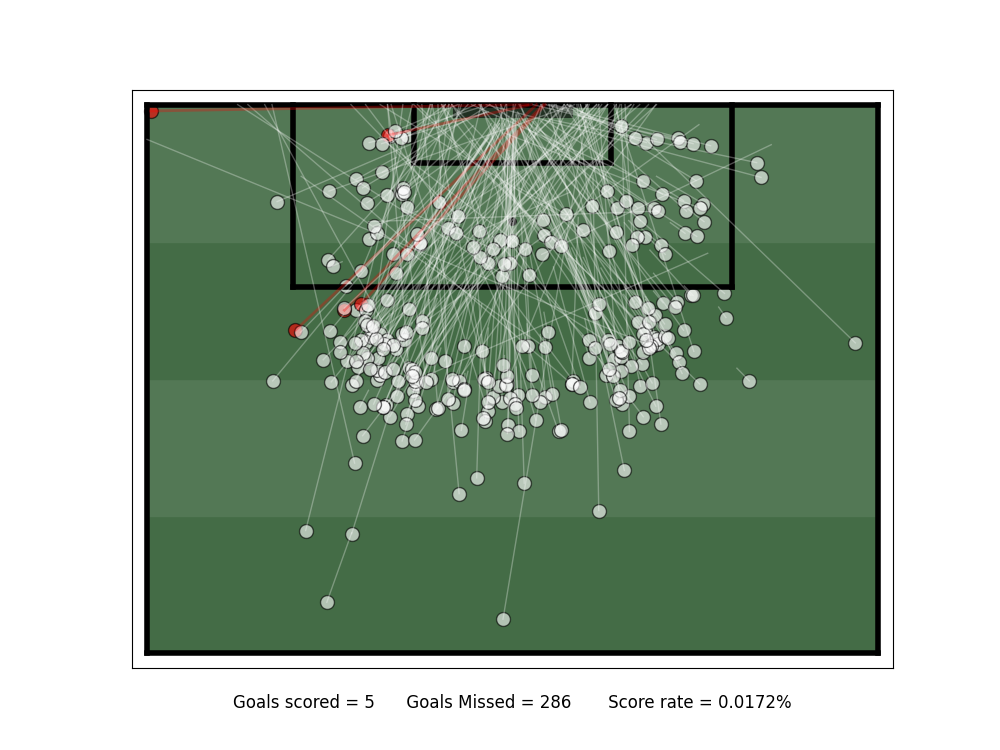
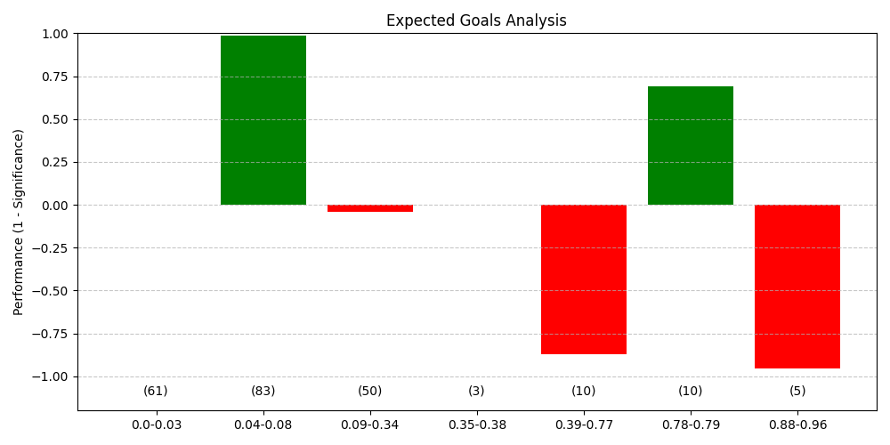
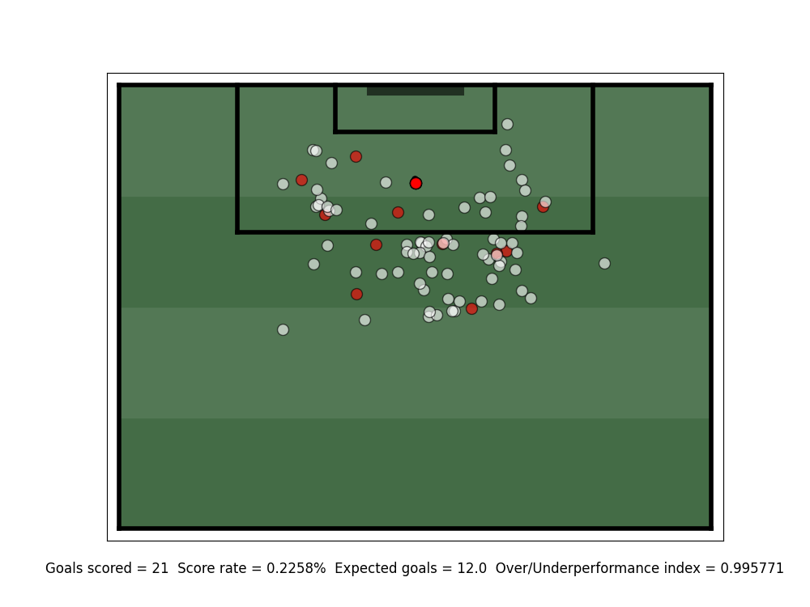

# Show All Shots Within Xg Range:

Simple script to show all shots within a chosen range of xG values. 

Asks the user to input a league and a season, then uses sofascore's shotmap features to get the data of 
every shot from that season. It then asks the user what range of Xg they would like to see, and whether 
they want to see the shot trails or not. It then displays those shots on a pitch, with goals being 
displayed as red dots with red trails, and misses being displayed as white dots with white trails. 
(displayed below)

 

input windows that appear when running the script


output with an input of 0.00 to 0.01 Xg range (without trails)



output with an input of 0.00 to 0.01 Xg range (with trails)

As you can see, the image can become quite cluttered with trails, which is why I added the option to 
remove them.

Something I like about this program is its simplicity. It is very easy to use, and the output is easy
to digest, it also offers insights into how Xg is determined, with clear patterns emerging in the 
locations of the shots.

# Chosen Player Shot Analysis:

Program written based on the idea that individual players' Xg over/underperformance is often 
misinterpreted.

Most of the time when people analyse whether a player is over or underperforming their Xg, they simply
look at the compound Xg and see if it's lower or higher than their total goals scored, respectively. 
However, this is not a good way of determining whether a player is good at taking their chances or not.
This is because every shot is, by definition, a chance, and so it doesn't make sense to simply add 
those probabilities together and say that that's how many goals they should have scored.

This program asks the user to input a player's name, and then again uses sofascore to collect all the 
shots that player has taken since sofascore started recording expected goals data in the competitions 
that player has played in. It then uses that data to determine the Xg ranges which the player is better 
or worse than expected at scoring from. It then displays these ranges on a bar graph, with the height 
of the bars being the extent to which they are over or underperforming their Xg in that range. The way 
that it calculates this is that it takes all the Xg values in the ranges and calculates the likelihood 
of scoring a certain number of goals from those Xg values. It then finds the most likely number of 
goals scored, and if that number is lower/higher than the actual number of goals scored, it is 
considered an over/underperformance, respectively. After it has calculated the most likely number of
goals and the probability of scoring the actual number of goals, it then uses the formula:

(1 - (probability of scoring actual number of goals / probability of scoring expected number of goals)) 

to determine the height of the columns in the bar graph. I know this sounds very confusing, so this is
what the graph looks like if you run the program with the player Cole Palmer:

It first outputs this text:

```
Segment: 0.0-0.03
Number of shots: 61
Expected goals: 1.0
Actual goals: 1


Segment: 0.04-0.08
Number of shots: 83
Expected goals: 4.0
Actual goals: 11


Segment: 0.09-0.34
Number of shots: 50
Expected goals: 8.0
Actual goals: 7


Segment: 0.35-0.38
Number of shots: 3
Expected goals: 1.0
Actual goals: 1


Segment: 0.39-0.77
Number of shots: 10
Expected goals: 5.0
Actual goals: 2


Segment: 0.78-0.79
Number of shots: 10
Expected goals: 8.0
Actual goals: 10


Segment: 0.88-0.96
Number of shots: 5
Expected goals: 5.0
Actual goals: 3
```

and also this graph:



In this instance, he is overperforming his expected goals for shots with an Xg of 0.04-0.08 and 
0.78-0.79, performing as expected for shots with an Xg of 0.0-0.03 and 0.35-0.38 and underperforming
for shots with an Xg of 0.09-0.34, 0.39-0.77 and 0.88-0.96. The numbers across the bottom of the graph
represent the number of shots in each range.

The program then asks the user:

```
Which shots would you like to see?
a) Overperforming
b) Normally Performing
c) Underperforming
```

and then displays the shots from Xg ranges that the user selects on a shotmap like the previous 
program.

For example, if you select 'a', the program will output this:

